## Requirements

I recently needed to add a custom button to a `Custom Object`'s `ListView` page. The goal was simple: users could select multiple records in the list view, then click the button to capture those records and process them.

Breaking it down, there are two core requirements:

- **1. Add a custom button to the ListView page**
- **2. The button must be able to receive the selected records**

## Feasibility Research

### Requirement 1: Adding a Custom Button

The entry point for adding a custom button to a ListView is in `Object Manager` → `List View Button Layout`:

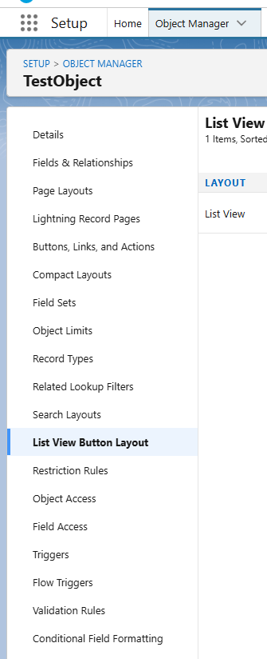

However, this option is not visible by default. You need to enable `Allow Search` in the object's `Detail` → `Edit` page for the `List View Button Layout` to appear:

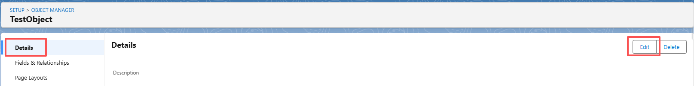
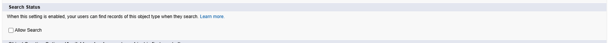

> **Note**: Enabling `Allow Search` makes the object visible in Salesforce's global search. If the object should not be searchable by all users for business reasons, make sure to disable this option after you're done configuring the button.

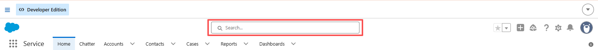

### Requirement 2: Passing Data to the Button

There are two approaches to capture selected records from a ListView:

- **Option A: Use Flow** — Flows have built-in variables to access selected records and pass them downstream. This article does not cover this approach.
- **Option B: Use Visualforce Page** — A Visualforce Page can capture the selected records and pass them to an Apex controller. This is the approach we'll use.

## Implementation

### Step 1: Create the Apex Class

`TestApexClass.cls`

```java
public class TestApexClass {

    public List<TestObject__c> selectedRecords { get; set; }
    private ApexPages.StandardSetController setCon;

    public TestApexClass(ApexPages.StandardSetController controller) {
        this.setCon = controller;
        // Capture the records selected in the ListView
        this.selectedRecords = (List<TestObject__c>) setCon.getSelected();
    }

    public PageReference firstButton() {
        // Process selectedRecords here
        return setCon.cancel();
    }

    public PageReference secondButton() {
        // Process selectedRecords here
        return setCon.cancel();
    }
}
```

> **About `setCon.cancel()`**: This built-in method of `ApexPages.StandardSetController` serves two purposes:
> 1. **Auto-redirects to the original list view** — Returns a `PageReference` that points back to the ListView the user was on, no manual URL construction needed.
> 2. **Resets controller state** — Discards any uncommitted changes and restores the controller to its original state.
>
> Without `return setCon.cancel()`, the user would be left staring at a blank Visualforce page after the Apex logic completes. With it, the browser automatically returns to the list view and refreshes the data — a seamless experience.

### Step 2: Create the Visualforce Page

`testVisualforce.page`

```html
<apex:page standardController="TestObject__c" recordSetVar="records" extensions="TestApexClass">
    <apex:form>
        <apex:pageBlock title="Selected Records">
            <apex:pageBlockButtons>
                <apex:commandButton value="Button One" action="{!firstButton}"/>
                <apex:commandButton value="Button Two" action="{!secondButton}"/>
            </apex:pageBlockButtons>

            <apex:pageMessages />

            <apex:pageBlockTable value="{!selectedRecords}" var="rec">
                <apex:column value="{!rec.Id}" headerValue="Record ID"/>
            </apex:pageBlockTable>
        </apex:pageBlock>
    </apex:form>
</apex:page>
```

### Step 3: Create the Custom Button

In `Object Manager`, find the target object, go to `Buttons, Links, and Actions`, and create a new `List Button` linked to the Visualforce Page from the previous step.

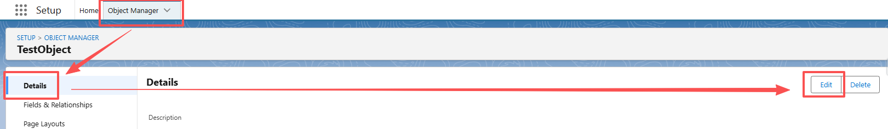
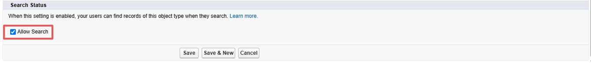
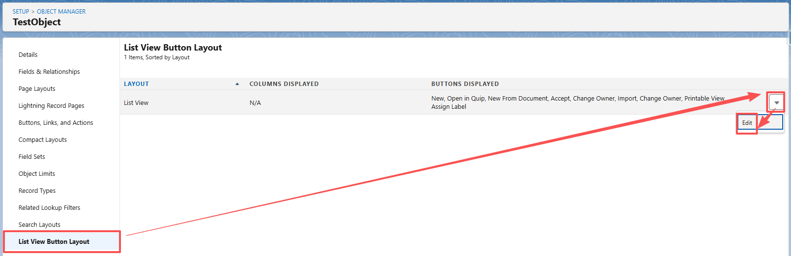
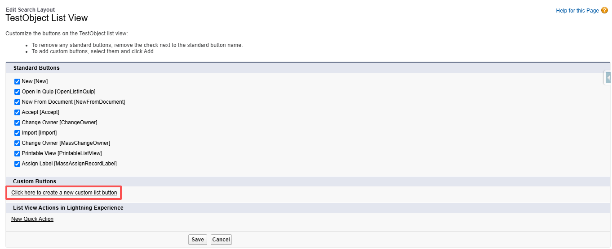
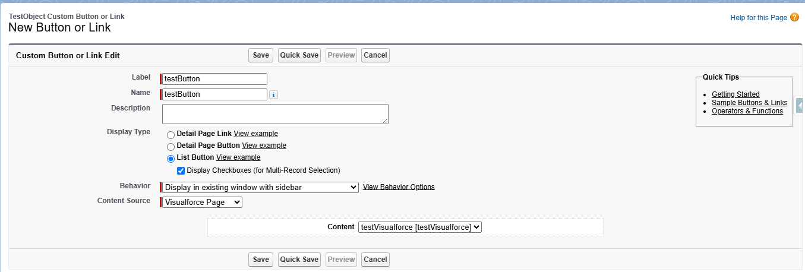

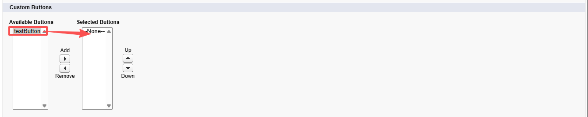

### Step 4: Test and Verify

Select several records in the ListView, click the custom button, and verify that the Visualforce Page loads correctly with the selected records displayed.

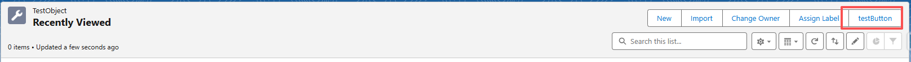
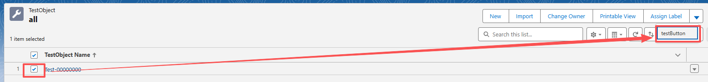
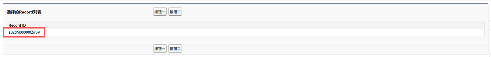